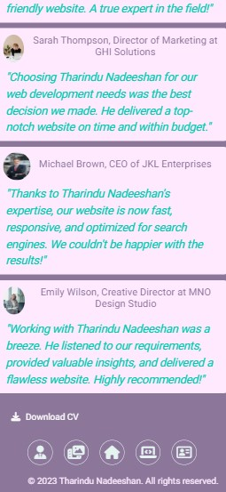

# Tharindu Nadeeshan - Personal portfolio site

Project - User-Centric Frontend Development - Code Institute.

## Site Goals

Creating a personal portfolio site allows me to showcase my skills and expertise as a web developer, highlighting my past projects, technical abilities, and design skills to demonstrate my value and differentiate myself from other developers. It helps me build my personal brand, establishing and expanding my online presence as a web developer, increasing visibility and attracting more opportunities for work or collaboration. By including contact information and social media profiles, I make it easy for others to reach out and connect, expanding my network of professional contacts and potential clients. Furthermore, my personal portfolio site serves as a powerful marketing tool, generating leads and attracting new business by showcasing my skills and past work to catch the attention of potential clients or employers seeking someone with my specific skills and experience. Ultimately, it helps me establish credibility and trust by providing detailed information about my expertise and experience, including testimonials from satisfied clients or colleagues.

## UX

### User Stories

#### As a Employer or Client

1. I want to see his work experience & educational background.
2. I want  know his technical skills.
3. I want go see his past projects.
4. I want to know what kind of services he offers.
5. I want a proof of his past work and quality of work. Need testimonials.
6. I want to to contact him.
7. I want to send my details to him.
8. I want to download his CV.

#### As the site Administrator

1. I want to update work experince and educational background.
2. I want to add my latest projects to the portfolio.
3. I want to add or remove testimonials which I get from clients.
4. I need to update the CV that links to the website.
5. I need to see the messeges that coming from clients and Employers.

### Strategy

#### Technical Capabilites

#### Target customer segment

1. Potential Clients: I am looking for new clients for my web development services, my target customer segment may be potential clients who are seeking someone with my specific skills and experience. These clients can range from individuals to small businesses or larger companies in need of a web developer for a particular project or ongoing work.

2. Employers: I'm seeking a full-time job as a web developer, my target customer segment may be potential employers who are searching for a candidate with my skills and experience. These employers can be small startups, mid-sized companies, or large corporations looking to hire a web developer for their development team.

3. Colleagues and Industry Peers: Another potential customer segment for my personal portfolio website may include colleagues and industry peers in the web development community. By showcasing my skills and past work, I can attract the attention of other web developers who may be interested in collaborating on projects or referring clients to me.

#### Business objectives

1. Showcase my skills and expertise: A personal portfolio site allows me to showcase my skills and expertise as a web developer. By highlighting my past projects, technical abilities, and design skills, I can demonstrate my value and differentiate myself from other developers.

2. Build my personal brand: A personal portfolio site helps me establish and build my personal brand as a web developer. By creating a unique and memorable online presence, I can increase my visibility and attract more opportunities for work or collaboration.

3. Expand my network: A personal portfolio site helps me expand my network of professional contacts and potential clients. By including contact information and links to my social media profiles, I can make it easy for others to reach out to me and connect.

4. Generate leads and new business: My personal portfolio site can serve as a powerful marketing tool, helping me generate leads and new business. By showcasing my skills and past work, I can attract the attention of potential clients or employers who are looking for someone with my specific skills and experience.

5. Establish credibility and trust: A personal portfolio site helps me establish credibility and trust with potential clients or employers. By providing detailed information about my skills and experience, including testimonials from past clients or colleagues, I can demonstrate my expertise and reliability.

#### Key requirements  considered for each audience

B2B Audience:

1. Professionalism: As a web developer targeting other businesses, my website has a professional look and feel. It conveys that I am serious about my business and capable of delivering high-quality services.

2. Showcase Relevant Skills: My portfolio highlights skills that are relevant to businesses, such as my experience with specific technologies or platforms commonly used in the industry.

3. Experience: I highlights my relevant experience working with other businesses or on projects similar to the ones I aim to acquire. This showcases my understanding of business needs and enhances my credibility.

4. Social Proof: I provided testimonials or case studies from previous business clients to offer social proof of my capabilities and successful collaborations.

B2C Audience:

1. Visual Appeal: My website is visually appealing, attention-grabbing, and reflective of my brand image. It caters to the tastes and preferences of the target audience I am aiming to attract.

2. User-Friendly: I needed to design the website to be user-friendly, ensuring easy navigation and engaging interactions that encourage visitors to explore further.

3. Showcase Creativity and Design: For a B2C audience, it is important to showcase my creativity and design skills to stand out from competitors. I incorporate visually captivating elements and innovative design solutions.

4. Highlight Benefits: I clearly communicated the benefits of working with me as a web developer to convince potential clients why they should choose me over competitors. I need to focus on how my services can meet their specific needs and provide value to their businesses.

#### User needs

1. Simplicity vs. Depth: As a web developer, I need to find a balance between simplicity and depth of information on my site. Users may prefer a simple and user-friendly interface, but they also want detailed information about my skills, past projects, and experience. I provide enough information to showcase my expertise while keeping the site easy to navigate and understand.

2. Visual Appeal vs. Accessibility: I consider the tradeoff between visual appeal and accessibility. While users appreciate visually stunning designs, it's important to ensure that my site is accessible to all users, including those with disabilities. I use alternative text for images, provide captions for videos, and ensure keyboard navigation for a fully inclusive experience.

3. Personal Branding vs. User Needs: Balancing personal branding and user needs is crucial. While I want to showcase my personal brand and style as a web developer, I also consider the preferences and needs of my target audience.

4. Content vs. Loading Time: I need to strike a balance between providing engaging and informative content and ensuring fast loading times. While high-quality content is important to showcase my skills and expertise, I optimize the site's performance to deliver a seamless browsing experience for users.

### Scope

#### Product requirements

1. User Interface (UI) requirements: This is related to the design, layout, and navigation of the website. It ensures that the website is visually appealing, easy to use, and intuitive.

2. Content requirements: This includes the type, quality, and quantity of content on the website. It ensures that the website has high-quality, relevant, and engaging content that communicates my skills, experience, and services effectively.

3. Functional requirements: It ensures that my website has all the necessary features portfolio management, contact forms, and analytics integration.

4. Performance requirements: It ensures that my website is fast responsive, and reliable, even under heavy traffic or usage.

5. Security requirements: It ensures the security and privacy of the website and its users such as SSL certificates, backups, and firewalls, to protect against hacking, data breaches, and other threats.

6. Compatibility requirements:It ensures that the website is compatible with all major browsers and devices, such as mobile phones, tablets, and desktop computers.

7. Accessibility requirements:It ensures to the accessibility of the website to people with disabilities.

### Structure

#### Information architecture

1. Home page: The home page provides a brief overview of my skills and experience as a web developer. It includes links to other sections of the website, such as my portfolio, about me, Services page and contact pages.

2. Portfolio page: The portfolio page showcases my work as a web developer. It features screenshots and descriptions of the projects I have completed, along with links to live websites or applications.

3. About me page: The about me page provides more detailed information about my background, skills, and experience as a web developer. It includes a professional photo and my contact information.

4. Services page: The services page highlights the services I offer as a web developer, such as web design,  E commerce web development, or SEO optimization. It includes testimonials from past clients or colleagues.

5. Contact page: The contact page includes a contact form or email address for inquiries. It also provides links to my social media profiles and other contact information for potential clients or collaborators to get in touch with me.

### Skeleton

#### Visual and navigational elements

Visual Elements:

1. Color scheme: Chose a color palette that reflects my personal brand and the type of services I offer.

2. Typography: Chose a visual apealing fonts, bullets and letter style.

3. Images and graphics: Incorporate high-quality images of my work, portfolio, or professional photo to add visual interest to the site.

4. Layout: Used a clean and modern layout to create a visually appealing and easy-to-read design.

5. Branding: Included my logo to reinforce my personal brand.

Navigational Elements:

1. Header: Included a header with the site logo and menu.

2. Navigation menu: Use a clear and concise navigation menu that is easy to understand and navigate.

3. Footer: Include a footer with additional navigation links, copyright information, link to download my CV and contact details.

4. Call-to-action buttons: Used clear and prominent call-to-action buttons throughout the site to encourage users to contacting me.

#### Mobile view wireframes

[Landing page Mobile first](./assets/wireframes/Home-mobile-min.jpg)

[About page Mobile first](./assets/wireframes/about-mobile-min.jpg)

[Portfolio page Mobile first](./assets/wireframes/portfolio-mobile-min.jpg)

[Services page Mobile first](./assets/wireframes/services-mobile-min.jpg)

[Contact page Mobile first](./assets/wireframes/contact-mobile-min.jpg)

#### Desktop view wireframes

[Landing page desktop](./assets/wireframes/home-desktop-min.jpg)

[About page desktop](./assets/wireframes/about-desktop1-min.jpg)
[About page desktop](./assets/wireframes/about-desktop2-min.jpg)

[Portfolio page desktop](./assets/wireframes/portfolio-desktop-min.jpg)

[Services page desktop](./assets/wireframes/services-desktop-min.jpg)

[Services page desktop](./assets/wireframes/testimonials-desktop-min.jpg)

[Contact page desktop](./assets/wireframes/contact-desktop-min.jpg)

## Features

### Existing Features

1. Responsive Design: The website is designed to be responsive and optimized for all devices, including mobile phones, tablets, and desktop computers.

2. User-Friendly Navigation: The website have user-friendly navigation that makes it easy for visitors to find the information they need quickly.

3. Home Page: The home page includes an overview of the web developer's services, skills, and experience.
    Desktop view

    

    Mobile view

    
    

4. About Page: The about page provides more detailed information about my background, qualifications, and experience.
   Desktop view
    

    Mobile view

    

5. Portfolio Page: The portfolio page showcases my past projects, including the technology used and the results achieved.
    Desktop view

    

    Mobile view

    

6. Services Page: The services page provide a detailed list of my services, including the technology used and testimonials that include customer reviews or feedback that speaks to the quality of my work.
    Desktop view

    

    Mobile view

    
    
    

7. Contact Page: The contact page includes a contact form and my contact information, such as email, phone number, or social media links.  
    Desktop view

    

    Mobile view

    
    

8. SEO Optimization: The website optimized for search engines to improve visibility and attract more traffic to the site.

9. Social Media Integration: The website have social media integration, allowing visitors to  follow me on different social media platforms.

10. Security: The website is secured with SSL certification.

### Features Left to Implement

1. In future I intend to add a blog page.
2. Site administrator need to update work experince and educational background.
3. Site administrator need to add my latest projects to the portfolio.
4. Site administrator need to add or remove testimonials which I get from clients.
5. Site administrator need to update the CV that links to the website.
6. Site administrator need to see the messages that coming from clients and Employers.
7. Need to add a option to rate my work with stars.
8. Need to add a feature that clients testimonials intantly apear on the page when they give their feedback.

## Technologies Used

- HTML5
- CSS3
- Bootstrap v4.5.3
- Google Chrome Dev tools for debugging
- Google Light house for audits
- Git source control
- VS code as IDE
- W3C validator used for HTML validating
- Jigsaw Validator used for CSS validation
  
## Testing

### Testing planning

Mainly following tests were planned

1. I need to launch the website in a browser to look for any layout or visual problems.
2. By engaging with various components, including links, buttons, forms, and navigation menus, I need to evaluate the website's functionality.
3. I need to check   all the user stories to confirm whether they are satisfied.
4. I want to test the website's performance by adjusting the size of the browser window and simulating various devices.
5. I need to check the website's cross-browser compatibility by opening it in several different browsers.
6. I want to check the HTML and CSS code for syntax issues or other warnings.
7. By completing forms and submitting data from different circumstances, I need to test forms and user input.
8. I need to double-check both the internal and external links to make sure they work properly.
9. By examining server response times and loading times of pages, I want to assess the website's performance.
10. By determining if the website complies with accessibility standards, I want to evaluate the website's usability.

I need to do all of these actions to guarantee that the website looks good, works properly, and offers a satisfying user experience throughout devices and browsers.

### Implementation

I carefully followed the pre-planned procedures when testing my web page to ensure a complete assessment. Chrome, Firefox, Opera, and Edge are the four widely used browsers I selected to test the website at the beginning. Using a thorough methodology, I was able to evaluate cross-browser compatibility and spot any discrepancies or problems that might exist across various platforms.

I made use of the Google Chrome developer tools to assess the website's performance. To imitate desktop and tablet viewpoints, I tested for a range of screen sizes, starting with the smallest and working my way up to the largest. This allowed me to verify that the website offered an seamless user interface and adjusted correctly to various screen sizes.

I used the element.style box in the Chrome tools' style section a lot while testing. Before adding my styling to the actual code, this functionality let me evaluate and confirm it. I could play with various categories and find any mistakes or missing parts by making changes to the actual document (editing in HTML). I carefully copied the correct code and smoothly implemented it into my codebase when the necessary change was confirmed.

I also evaluated the website's performance and accessibility using Google Lighthouse. This tool offered perceptions into potential development areas. I concentrated on reducing image sizes in order to improve performance. I tried to reduce the size of the files without sacrificing visual quality by scaling down the photographs and properly compressing them. The website became quicker and more responsive as a result of this optimisation.

I gave careful consideration to the contrast ratio of the font colours selected on the page in purposes of easy access. I made sure that the contrast among the text and its background was sufficient to satisfy accessibility standards so that individuals with visual disabilities could easily read it. I tried to make the material easily readable for everyone who looked at it by choosing acceptable colour schemes and modifying the formatting as necessary.

I added visually masked texts to improve accessibility even further. I took measures to make sure that crucial details, including labels for form inputs, were seen by screen readers by employing methods like visibly hidden CSS classes or the aria-label attribute. For visually challenged viewers, these hidden texts offered additional context, ensuring that they could engage with and comprehend the content efficiently.

To ensure code quality and compliance with standards, I frequently used the Jigsaw and W3C validators. These tools helped me identify any syntax errors, structural issues, or non-compliant elements in my HTML and CSS code. By rectifying these concerns promptly, I maintained a high level of code integrity.

I carefully checked the operation of all four browsers' buttons, links, forms, and other interactive features during the testing process. This all-encompassing strategy made sure that all website functions were completely functional and offered a smooth user experience independent of the selected browser.

I made sure that my website complied with the highest requirements for functionality, usability, and satisfaction among users by sticking to this comprehensive testing technique, which covered browser compatibility, responsiveness, code validation, accessibility, and performance optimisation.

### Results and outcomes

#### Testing User Stories

As an Employer or Client Expectations:

1. I want to see his work experience & educational background.
2. I want  know his technical skills.
3. I want go see his past projects.
4. I want to know what kind of services he offers.
5. I want a proof of his past work and quality of work. Need testimonials.
6. I want to to contact him.
7. I want to send my details to him.
8. I want to download his CV.

As a user Results:

1. I can see his work experience & educational background in About Page.
2. I can see his technical skills in About Page.
3. I can see his past projects Portfolio page.
4. I can see what kind of services he offers Services page.
5. He has proof of his past work and quality of work. I can see testimonials in Services page.
6. I can contact him through social icons and details in the contact page.
7. I can send my details to him through contact form in Contact page.
8. I can to download his CV from Download CV button.

#### Testing Accessibility and Performance

I used google lighthouse to check Accessibility and Performance. I tested for Mobile and Desktop views of every page.

Results can be shown as follows and images can be access through links

|                    | Performance | Accessibility | Best Practices | SEO |
| ------------------ | ----------- | ------------- | -------------- | --- |
| [Home -Desktop](./assets/testing-light-house/home-desktop-test.jpg)      | 99%         | 100%          | 100%           | 90% |
| [Home- Mobile](./assets/testing-light-house/home-mobile-test.jpg)       | 85%         | 100%          | 100%           | 90% |
| [About -Desktop](./assets/testing-light-house/about-desktop-test.jpg)    | 98%         | 100%          | 100%           | 90% |
| [About- Mobile](./assets/testing-light-house/about-mobile-test.jpg)      | 82%         | 100%          | 100%           | 90% |
| [Portfolio -Desktop](./assets/testing-light-house/portfolio-desktop-test.jpg) | 96%         | 100%          | 100%           | 90% |
| [Portfolio- Mobile](./assets/testing-light-house/portfolio-mobile-test.jpg)  | 68%         | 100%          | 100%           | 90% |
| [Services -Desktop](./assets/testing-light-house/services-desktop-test.jpg)  | 100%        | 100%          | 100%           | 90% |
| [Services- Mobile](./assets/testing-light-house/services-mobile-test.jpg)   | 92%         | 100%          | 100%           | 89% |
| [Contact -Desktop](./assets/testing-light-house/contact-desktop-test.jpg)   | 100%        | 100%          | 100%           | 90% |
| [Contact- Mobile](./assets/testing-light-house/contact-mobile-test.jpg)    | 96%         | 100%          | 100%           | 90% |

#### Testing functionalities/features and Responsiveness

I checked functionalities/features of each element with different browsers as well as with different device sizes

results can be shown as follows

| Feature                     | Expect                                                                                                                                | Action                                                                   | Result for each browser                                                                                                                                                                                                    |
| --------------------------- | ------------------------------------------------------------------------------------------------------------------------------------- | ------------------------------------------------------------------------ | -------------------------------------------------------------------------------------------------------------------------------------------------------------------------------------------------------------------------- |
| Logo                        | When clicked the logo image Home page will open                                                                                       | Clicked the Logo image                                                   | **Chrome:** Home Page opened **Opera:** Home Page opened **Firefox:** Home Page opened **Edge:** Home Page opened                                                                                 |
| Nav Bar buttons             | When I click each button relevent page will open                                                                                      | Clicked the navbar buttons                                               | **Chrome:** Opened correct page **Opera:** Opened correct page **Firefox:** Opened correct page **Edge:** Opened correct page                                                                     |
| Social Icons                | When I click each button relevant external link will open in a new tab                                                                | Clicked the social icons                                                 | **Chrome:** Opened relevant page in a new tab **Opera:** Opened relevant page in a new tab **Firefox:** Opened relevant page in a new tab **Edge:** Opened relevant page in a new tab             |
| Download CV button          | When I click the button CV will download in a new tab                                                                                 | Clicked the Download CV button                                           | **Chrome:** Downloaded the cv ina new tab **Opera:** Downloaded the cv ina new tab **Firefox:** Downloaded the cv ina new tab **Edge:** Downloaded the cv ina new tab                             |
| Contact me button           | When I click the button redirect me to the Contact page                                                                               | Clicked the contact me button                                            | **Chrome:** Opened the Contact page **Opera:** Opened the Contact page **Firefox:** Opened the Contact page **Edge:** Opened the Contact page                                                     |
| Tab panel buttons           | When I click each tab button each tab-pane will open                                                                                  | Clicked the buttons in tab panel                                         | **Chrome:** Opened Each tab pane **Opera:** Opened Each tab pane **Firefox:** Opened Each tab pane **Edge:** Opened Each tab pane                                                                 |
| Portfolio links             | When I click the links each website will open in a new tab                                                                            | Clicked the links in the cards in Portfolio section                      | **Chrome:** Opened relevant website in a new tab **Opera:** Opened relevant website in a new tab **Firefox:** Opened relevant website in a new tab **Edge:** Opened relevant website in a new tab |
| Hire me Button              | When I click the button redirect me to the Contact page                                                                               | Clicked the hire me button                                               | **Chrome:** Opened the Contact page **Opera:** Opened the Contact page **Firefox:** Opened the Contact page **Edge:** Opened the Contact page                                                     |
| Form submit button          | form submits when submit button clicked                                                                                               | Clicked the submit button on the form                                    | **Chrome:** The form successfully submitted on click **Opera:** The form successfully submitted **Firefox:** The form successfully submitted **Edge:** The form successfully submitted            |
| Introduction Home page      | When page loads introduction text will appear with an animation                                                                       | Refresh the Home page                                                    | **Chrome:** Fade effect worked correctly **Opera:** Fade effect worked correctly **Firefox:** Fade effect worked correctly **Edge:** Fade effect worked correctly                                 |
| Mobile view responsiveness  | When changed the screen size to the mobile device size, all elements appear in the correct place and the toggler button should appear | Checked screen width sizes  for screen widths less than 768px            | **Chrome:** all elements appeared correctly **Opera:** all elements appeared correctly **Firefox:** all elements appeared correctly **Edge:** all elements appeared correctly                     |
| Tablet view responsiveness  | When changed the screen size to the tablet device size, all elements appear in the correct place.                                     | Checked screen width sizes  for screen widths between 768px  and  992px. | **Chrome:** all elements appeared correctly **Opera:** all elements appeared correctly **Firefox:** all elements appeared correctly **Edge:** all elements appeared correctly                     |
| Desktop View responsiveness | When changed the screen size to the Desktop device size, all elements appear in the correct place.                                    | Checked screen width sizes for screen widths greater than 992px.         | **Chrome:** all elements appeared correctly **Opera:** all elements appeared correctly **Firefox:** all elements appeared correctly **Edge:** all elements appeared correctly                     |

#### Validating

Validation done throghout the development and all the error and warnings are fixed.

following validators have been used to validated HTML and CSS codes.

- [W3C validator](https://validator.w3.org/) used for HTML validating
- [Jigsaw Validator](https://jigsaw.w3.org/css-validator/) used for CSS validation

## Deployment

The project was done using Codeanywhere with VS Code. Github used for version control and used as the code hosting platform.
Commits are done regulary and using terminal as well as inbuilt source control tab in VS code.

Github pages were used to deploy the site. Selected the master Branch from the source section drop-down menu by navigating settings tab in the GitHub repository.Detailed ribbon was appeared and page was automatically refreshed with successful deployment.

The live link can be found from here : <https://hpatnadeeshan.github.io/MS-1>

## Bugs

I found several bugs while I was developing the website. Here How i identify and dubug the each bug.

1. As per my design I wanted to set Nav bar center of header for desktop and tablet views.  However when comes to mobile devices it is more user friendly to set  toggler button  on right top corner. Therefore I had to use nav bar bootstrap class in 2 different div elements(debug). It took considerable time to make the toggler button work properly.
2. In my design i wanted to set my web page takeplace whole view port area for desktop view without any scrolling. For acheive the purpose I had to change the footer position fixed and relative different device widths and heights. In  that case I found footer icon intersect with page content when its come to tablet view and cant see the bottom part of the page content due to this bug. Debugging was done considering breakponits(768px, 992px) as well as considering height of each type of devices. I had to use CSS nested media qurries to debug.
3. I found some poor contrast ratio when I was using lighthouse tool for testing accessibilty. Since I decided to use  a matching color pallet for each page. since I could not change the basic theme i did change small color changes using a color contrast analyzer by changing the lightness of font colors according to color contrast guildline.  I frequently used google developer tool to see the changes before coding.
4. When it comes to tablet view I found a bug in nav bar about me word appear in 2 lines and it increse the height of nav bar and other texts in navbar looks asymmetric since text are not vertically align. Also it is not look visually appealing. I had to reduce the horizontal padding of related button class to debug this.I tried several method but this is the less coding method.

All above bugs are found at final stage of developing. However more than 30 bugs were identified and debug while developing the website. Chrome developer tool played a major part for debugging and had use CSS media qurries widely to debug.

## Credits

### Content

1. Social icons, Services icons and footer icons were taken from Font Awesome.
2. Bootstrap framework used throughout the website.
   - media quieries used in everypage
   - Jumbotron component used in Home page
   - Navbar used in every page
   - nav-tabs in About page
   - progress bars in About page
   - pagination in Portfolio page
   - Image Cards in Portfolio page
   - Contact form in Contact page
   - call in action buttons
  
3. Google Fonts used in the website (Roboto & Exo)
4. Code for the Timeline in About page was taken from Mini project(the Resume Project) by Code Institute, Ireland.

### Media

1. Images for Portfolio page were taken from following websites
   <https://www.getbootstrap.com>
   <https://www.w3schools.com>
   <https://developer.mozilla.org>
   <https://www.wikipedia.org>
2. Splash image in Home page and clients images were taken from <https://www.pexels.com/>

## Acknowledgements

- [Awesome Readme Templates](https://awesomeopensource.com/project/elangosundar/awesome-README-templates)
- [Awesome README](https://github.com/matiassingers/awesome-readme)
- [How to write a Good readme](https://bulldogjob.com/news/449-how-to-write-a-good-readme-for-your-github-project)

**This project was created for the Code Institute Module of User Centric front end development**

**Created by Tharindu Nadeeshan**
